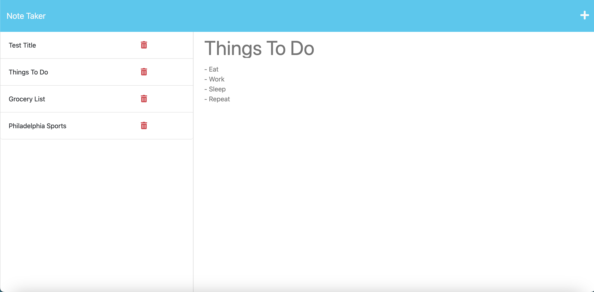

# Note-Taker

Link to example video showing the save and delete features:

https://drive.google.com/file/d/1KQhHlsabnKeopuYWQYHmnD4tNMar0Gho/view?usp=sharing

Link to Heroku app:

https://calm-hollows-09005.herokuapp.com/notes

## Description
  A note taking application that allows users to create mulitple notes with a title and text. Once a note is created, the user can choose to save it by clicking on the save button that appears at the top right after they've began typing. Each saved note is then listed on the left side. The user can also choose to delete the note by clicking on the delete button next to the saved note.

  ## Installation
  - Run "npm install" to install everything needed.

  ## Contributing
  N/A

  ## Questions?
  Feel free to ask any questions you may have by reaching out to the following:

  Github: https://github.com/Austin1094
  Email: Austin.Adams1094@gmail.com